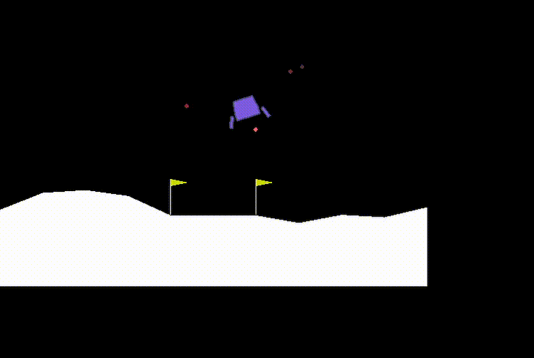
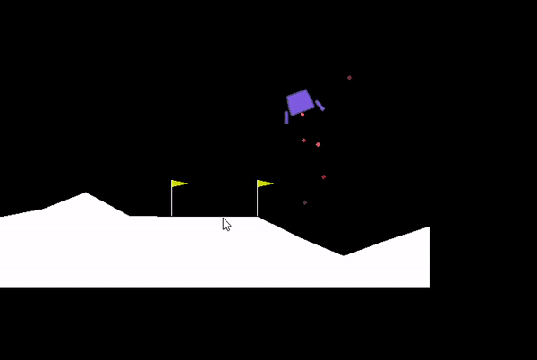
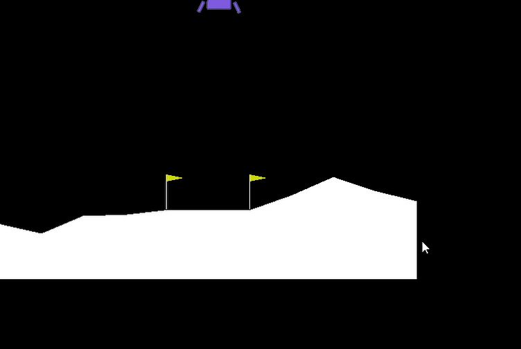

# LunarLanderAgent
 reinforcement learning for LunarLander with tensorflow

I had difficulty initiating the Box2d installation, I tried `pip install Box2d` instead of `pip install gym[all]` and it worked.

Making sure the environment works:
## Dummy Code:

```
import numpy as np
import matplotlib.pyplot as plt
import tensorflow as tf
import gym

env = gym.make('LunarLander-v2')
obs = env.reset()

for i in range(1000):
    obs, reward, done, info = env.step(env.action_space.sample())
    env.render()
    if done:
        break

env.close()

```
The animation:



In the code `obs = env.reset()`

`obs = [-0.00738106  1.4114584  -0.7476334   0.02389351  0.00855954  0.16935012
  0.          0.        ]`

**The obs =** ```[position_x, position_y, velocity_x, velocity_y, lander_angle, lander_angular_velocity, left_leg_contact(bool), right_leg_contact(bool)]```

## Action Space:
<ul>
<li>0 = do nothing</li>
<li>1 = Fire left engine</li>
<li>2 = Fire main engine</li>
<li>3 = Fire right engine</li>
</ul>

# WORKING CODE = main.py

### 250 Episodes later:

The agent somewhat learns to land.



## 760 Episodes later:
The agent can land easily:


I didn't train the model more than 763 episodes as it was time consuming. Anyway thanks for reading!
